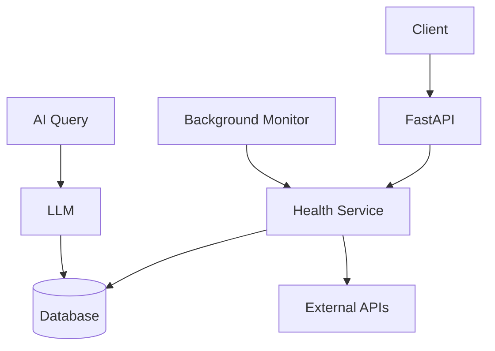

# 🚀 API Health Monitoring & Load Testing System

## 🌍 Live Demo

https://api-sentinel-ljpg.onrender.com

---

## 🧠 Project Overview

This project is a backend system built using FastAPI to monitor external APIs, track their uptime, analyze performance, and perform load testing.

It also includes a GenAI-powered query system that allows users to ask questions in natural language and get insights from API health data.

---

## 🔥 Features

### ✅ Core Features

- Add and manage APIs
- Automatic background monitoring every 30 seconds
- Async API health checks using AsyncIO and HTTPX
- Store historical health logs (status + response time)
- Uptime and reliability statistics
- Load testing with concurrent requests

### 🤖 AI-Powered Query System

- Ask questions in natural language
- Converts query → SQL using LLM (Groq + LangChain)
- Executes SQL on database
- Returns clean, human-readable answers

#### Example Queries:

- "Which APIs are down?"
- "Which APIs are slow?"
- "Show APIs with response time greater than 1 second"
- "Which API failed most?"

---

## 🛠 Tech Stack

- FastAPI
- AsyncIO
- SQLAlchemy (Async)
- SQLite (aiosqlite)
- HTTPX
- LangChain
- Groq (LLM)

---

## ⚙️ How It Works

### 1. Background Monitoring

A background task runs every 30 seconds:

- Fetches all APIs
- Checks health asynchronously
- Stores results in database

---

### 2. Async Health Checks

- Uses `httpx.AsyncClient` for non-blocking requests
- Measures response time using `time.perf_counter()`
- Runs concurrent checks using `asyncio.gather()`

---

### 3. Load Testing

- Sends multiple concurrent requests to an API
- Calculates performance metrics:
  - Success rate
  - Avg, min, max response time

---

### 4. AI Query Pipeline

```text
User Question
   ↓
LLM (LangChain + Groq)
   ↓
Generate SQL
   ↓
Execute SQL (SQLite)
   ↓
LLM converts result → human answer
```

---

## 🏗 Architecture



---

## 🚀 Setup & Run

### Installation

```bash
# clone repo
git clone <your-repo-url>
cd api-sentinel

# create venv
python -m venv venv
source venv/bin/activate

# install deps
pip install -r requirements.txt
```

### Run Server

```bash
uvicorn app.main:app --reload
```

Docs:

- http://127.0.0.1:8000/docs

---

## 📡 API Endpoints

### API Management

- `POST /apis/`
- `GET /apis/`
- `GET /apis/{id}`

### Monitoring

- `POST /apis/{id}/check`
- `GET /apis/{id}/logs`
- `GET /apis/{id}/stats`

### Load Testing

- `POST /apis/{id}/load-test?n=50`

### 🤖 AI Query

- `POST /apis/ai/query?question=...`

---

## 📊 Example Output

```json
{
  "answer": "Instagram and Google APIs had response time greater than 1 second."
}
```

---

## ⚠️ Notes

- SQLite is used → data may reset on deployment restart
- Free Render tier may sleep → first request can be slow
- AI responses depend on LLM accuracy

---

## 📚 What I Learned

- Async programming with FastAPI
- Background task scheduling
- Concurrency with asyncio.gather
- API performance monitoring
- GenAI integration (NL → SQL → Answer)
- Handling LLM outputs and validation

---

## 👨‍💻 Author

Avishkar Jadhav
