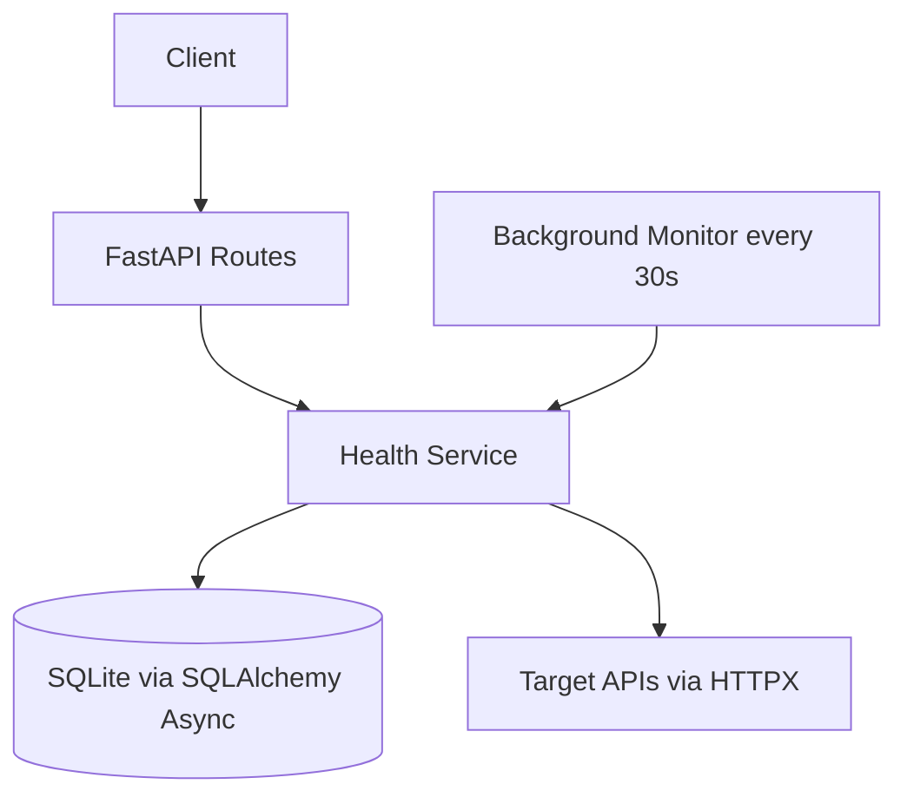

# API Health Monitoring and Load Testing

## Project Overview

This backend project is built with FastAPI to help you monitor external APIs and measure their reliability and performance over time.

It allows you to:
- Register APIs to monitor
- Run automatic health checks in the background every 30 seconds
- Store historical health logs (status + response time)
- Calculate uptime and reliability statistics
- Run concurrent load tests and view performance metrics

The project is designed to be beginner-friendly while using production-relevant async patterns.

## Features

- Add and manage monitored APIs
- Automatic background monitoring every 30 seconds
- Async API checks using AsyncIO and HTTPX
- Health log history with response time tracking
- API stats:
	- Uptime percentage
	- Failure rate
	- Average response time
	- Last known status
- Load testing with configurable request count
- Performance metrics:
	- Success rate
	- Min, max, and average response time

## Tech Stack

- FastAPI
- AsyncIO
- SQLAlchemy (async)
- SQLite (with `aiosqlite`)
- HTTPX

## How It Works

### 1. Background Monitoring

When the app starts, a background task is created that:
- Fetches all registered APIs from the database
- Checks each API health asynchronously
- Stores results in the health logs table
- Sleeps for 30 seconds, then repeats

This provides continuous monitoring without blocking the API server.

### 2. Async Health Checks

Each API check uses:
- `httpx.AsyncClient` for non-blocking HTTP requests
- `time.perf_counter()` to calculate response time
- Async database writes via SQLAlchemy async session

Checks are executed concurrently using `asyncio.gather(...)` for efficiency.

### 3. Load Testing

Load testing sends multiple concurrent requests to a selected API endpoint and returns summary metrics including success rate and timing stats.

## Architecture

### High-Level Components

- FastAPI app and routers handle incoming requests.
- Background monitor runs every 30 seconds using AsyncIO.
- Health service performs async HTTP checks using HTTPX.
- SQLAlchemy async layer stores APIs and health logs in SQLite.

### Request and Monitoring Flow



## Setup and Run

### Prerequisites

- Python 3.10+

### Installation

1. Clone the repository and move into the project folder.
2. Create a virtual environment:

```bash
python -m venv .venv
```

3. Activate the virtual environment:

```bash
source .venv/bin/activate
```

4. Install dependencies:

```bash
pip install -r requirements.txt
```

### Run the Server

```bash
uvicorn app.main:app --reload
```

API will be available at:
- `http://127.0.0.1:8000`

Interactive docs:
- Swagger UI: `http://127.0.0.1:8000/docs`
- ReDoc: `http://127.0.0.1:8000/redoc`

## API Endpoints

### Root

- `GET /` - Service health message

### API Management

- `POST /apis/` - Add a new API
- `GET /apis/` - List all APIs
- `GET /apis/{id}` - Get API by ID

### Monitoring and Logs

- `POST /apis/{id}/check` - Run an immediate health check for one API
- `GET /apis/{id}/logs` - Fetch health check logs (latest first)
- `GET /apis/{id}/stats` - Get aggregated uptime and reliability stats

### Load Testing

- `POST /apis/{id}/load-test?n=20` - Run load test with `n` concurrent requests

## Example Response JSON

### Health Check (`POST /apis/{id}/check`)

```json
{
	"status_code": 200,
	"response_time": 0.1432,
	"is_healthy": true
}
```

### Stats (`GET /apis/{id}/stats`)

```json
{
	"total_checks": 120,
	"healthy_checks": 114,
	"uptime_percentage": 95.0,
	"failure_rate": 5.0,
	"avg_response_time": 0.1824,
	"last_status": "UP",
	"last_checked_at": "2026-03-19T09:30:12.145000"
}
```

### Load Test (`POST /apis/{id}/load-test?n=50`)

```json
{
	"total_requests": 50,
	"successful_requests": 48,
	"failed_requests": 2,
	"success_rate": 96.0,
	"avg_response_time": 0.2103,
	"min_response_time": 0.0891,
	"max_response_time": 0.5844
}
```

## Notes

- Health checks currently mark an API as healthy when HTTP status is `200`.
- Timeout for checks is set to 5 seconds.
- SQLite database and tables are initialized automatically on startup.
